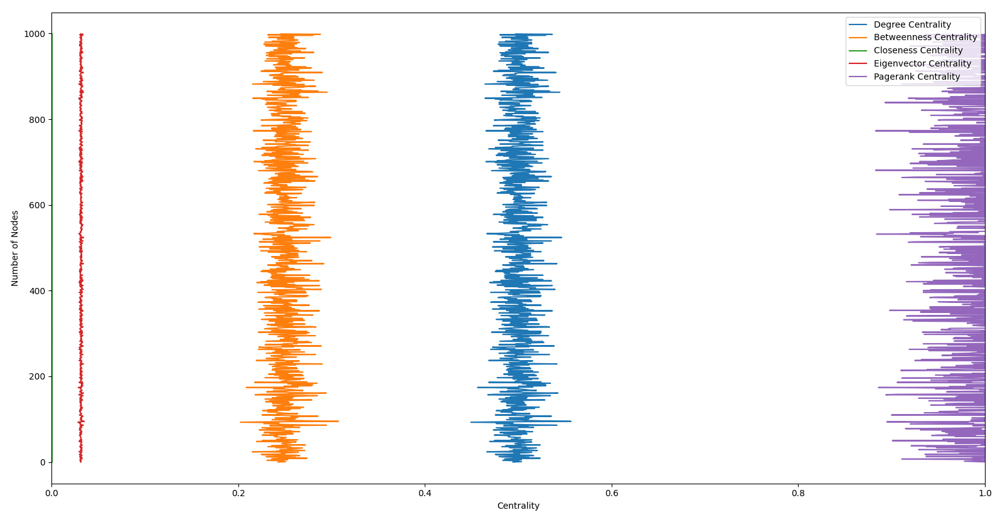
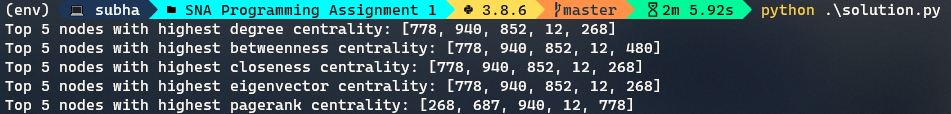
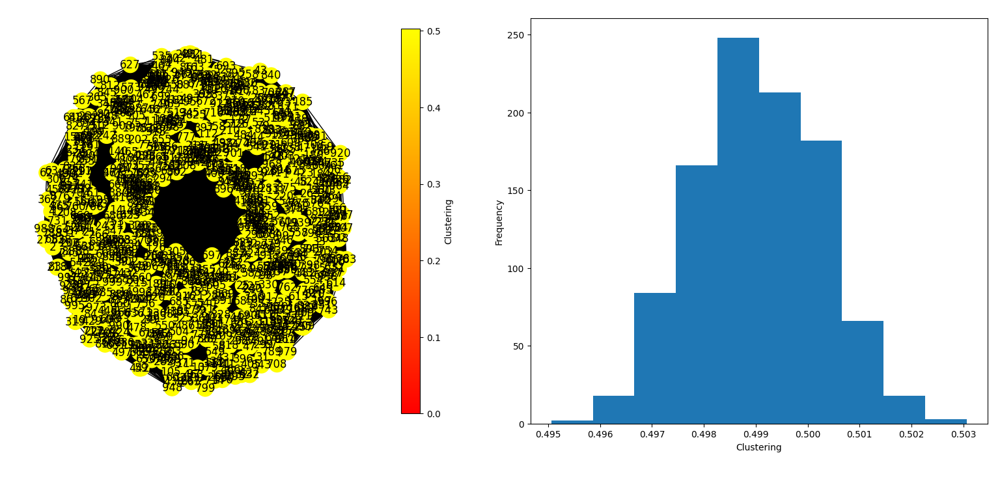

# SNA Programming Assignment 1

Finding out different centrality measures and clustering coefficient of a random graph.

## Comparison between different centrality measures

## Top 5 nodes with highest centralities

## Clustering coefficient

